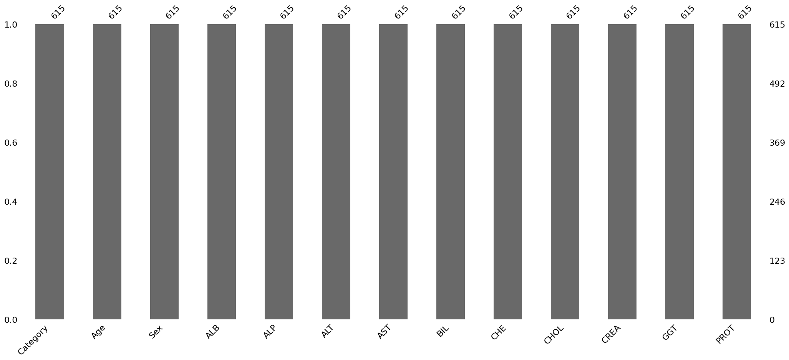
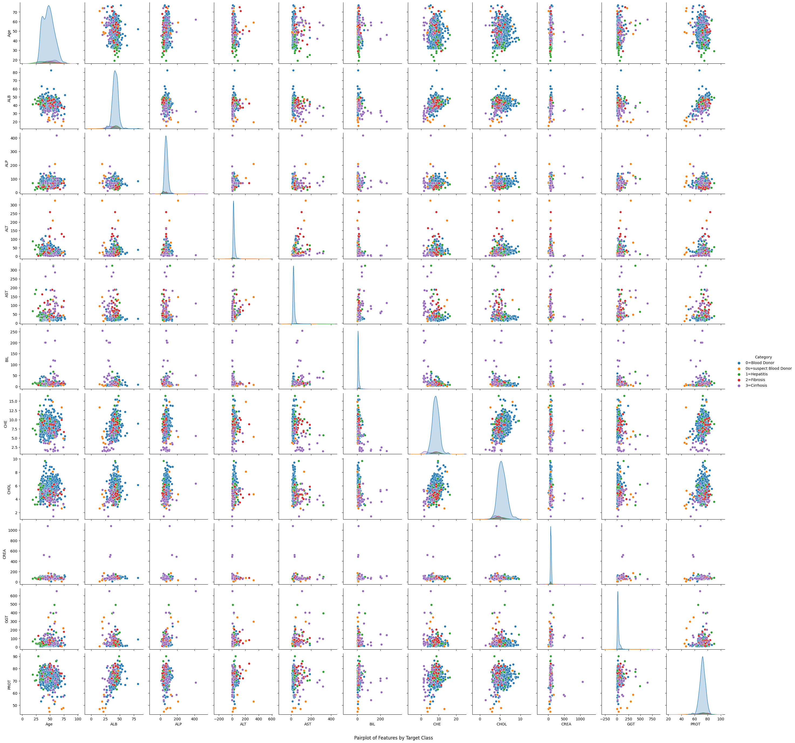
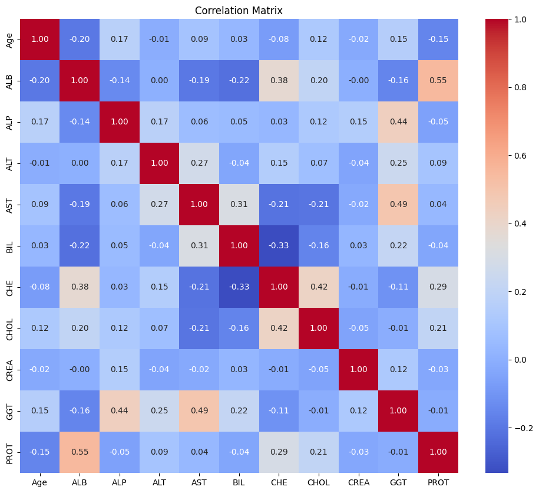
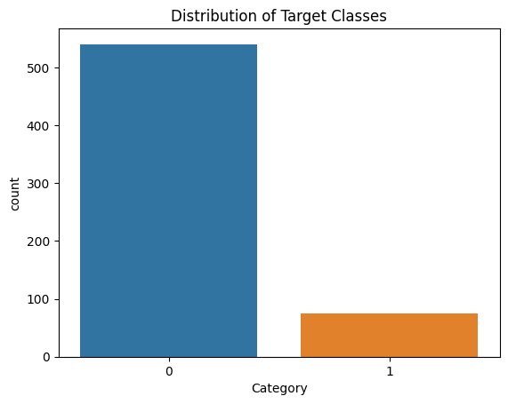

# Laporan Proyek Machine Learning 

### Nama : Tugiyanto<br>
### Nim  : 211351146<br>
### Kelas : Malam B

# Domain Proyek 
Proyek ini berfokus pada prediksi penyakit Hepatitis C berdasarkan data pasien, termasuk faktor-faktor seperti usia, jenis kelamin, dan nilai-nilai laboratorium. Hepatitis C adalah penyakit hati yang dapat berkembang menjadi kondisi serius seperti fibrosis dan sirosis.Namun pada kasus ini hanya memprediksi pasien yang terkena hepatitis dan non Hepatitis. Identifikasi dini dan klasifikasi pasien Hepatitis C adalah langkah awal untuk penanganan yang efektif. Pengetahuan tentang penyakit Hepatitis C sangat penting dalam bidang kedokteran dan kesehatan masyarakat

# Business Understanding?
## Problem Statements
* Bagaimana memprediksi kategori diagnosis pasien Hepatitis dan non Hepatitis?

# Goals
* Mengembangkan model machine learning yang dapat memprediksi diagnosis pasien Hepatitis C dengan akurasi yang tinggi.

* Membuat alat bantu medis yang dapat membantu dalam memahami status kesehatan pasien Hepatitis C.
# Data Understanding
Dataset yang digunakan bersumber dari kaggle, dan link dataset bisa diakses di link dibawah ini : 
https://www.kaggle.com/datasets/fedesoriano/hepatitis-c-dataset
### Data yang digunakan dalam datasets ini berasal dari UCI Machine Learning Repository
## Variabel-variabel pada Dataset adalah sebagai berikut:
* Age: Umur pasien dalam tahun. (int64)
* Sex: Jenis kelamin pasien (0 untuk laki-laki, 1 untuk perempuan). (object)
* ALB: Konsentrasi serum albumin. (float64)
* ALP: Fosfatase alkali. (float64)
* ALT: Enzim alanine transaminase. (float64)
* AST: Enzim aspartate aminotransferase. (float64)
* BIL: Bilirubin. (float64)
* CHE: Kolinesterase. (float64)
* CHOL: Kolesterol. (float64)
* CREA: Kreatinin. (float64)
* GGT: Gamma-glutamyl transferase. (float64)
* PROT: Protein total. (float64)
* Category: Kategori diagnosis pasien (0=Blood Donor, 0s=suspect Blood Donor, 1=Hepatitis, 2=Fibrosis, 3=Cirrhosis). (object )
# Data Preparation
### disini saya akan menkoneksikan google colab menggunakan token dari akun saya :
```python 
from google.colab import files
files.upload()
```
### Disini saya akan membuat direktori untuk penyimpanan file kaggle.json
```python
!mkdir -p ~/.kaggle 
!cp kaggle.json ~/.kaggle/
!chmod 600 ~/.kaggle/kaggle.json
!ls ~/.kaggle
```
## Unduh datasets
### Disini saya akan mendowload file datasetnya dari kaggle :
```python
!kaggle datasets download -d fedesoriano/hepatitis-c-dataset
```
## Extract file
### Disini saya akan mengekstrak file dari dataset yang sudah saya download :
```python
!unzip hepatitis-c-dataset.zi
```
## Import library
### Disini saya menggunakan beberapa library :
```python
import pandas as pd
import numpy as np
import seaborn as sns
import matplotlib.pyplot as plt
import missingno as msno
from sklearn.model_selection import train_test_split
from sklearn.preprocessing import LabelEncoder
from sklearn.preprocessing import StandardScaler
from sklearn.neighbors import KNeighborsClassifier
from sklearn.metrics import accuracy_score, confusion_matrix
from sklearn.metrics import classification_report
from sklearn import metrics
import pickle
```
## Inisialisasi DataFrame
### setelah saya akan panggil dataset yang akan digunakan :
```python
df = pd.read_csv('/content/hepatitis-c-dataset/HepatitisCdata.csv')
```
### Setelah saya panggil dataset, saya akan melihat lima data teratas dari dataset :
```python
df.head()
```
### Setelah itu saya akan melihat info bentuk data dari dataset :
```python
df.info()
```
### Disini saya akan melihat jumlah data dari kolom dan baris : 
```python
df.shape
```
### Setelah itu saya akan melihat jumlah isi data dari kolom Category : 
```python
df['Category'].value_counts()
```
### Disini saya akan menghapus kolom yang diasumsikan bahwa kolom tersebut tidak diperlukan atau berisi informasi yang tidak relevan :
```python
df = df.drop(['Unnamed: 0'],axis=1)
```
### Disin saya akan memeriksa sejauh mana data mengandung nilai null dan apakah perlu tindakan koreksi atau penanganan data yang diperlukan: 
```python
df.isnull().sum()
```
### Disini saya akan Mengganti nilai null dalam kolom dengan nilai mean :
```python
df['ALB'].fillna(df['ALB'].mean(), inplace=True)
df['ALP'].fillna(df['ALP'].mean(), inplace=True)
df['CHOL'].fillna(df['CHOL'].mean(), inplace=True)
df['PROT'].fillna(df['PROT'].mean(), inplace=True)
df['ALT'].fillna(df['ALT'].mean(), inplace=True)
```
### Disin saya akan memeriksa sejauh mana data mengandung nilai null dan apakah perlu tindakan koreksi atau penanganan data yang diperlukan:
```python
df.isnull().sum()
```
### Disini saya akan melihat hist dari dataset :
 ```python
 p = df.hist(figsize = (20,20))
 ```
 

 ### Disini saya akan melihat missingno dari dataset :
  ```python
 p=msno.bar(df)
 ```
  
 ### Disini saya akan mengecek distribusi kolom dan baris dengan  pairplot :
 ```python
 sns.pairplot(df, hue='Category')
plt.suptitle("Pairplot of Features by Target Class", y=0)
plt.show() 
```


### Disini saya akan melihat Heatmap dari dataset : <br>

   ```python
   correlation_matrix = df.corr()
plt.figure(figsize=(12, 10))
sns.heatmap(correlation_matrix, annot=True, cmap='coolwarm', fmt=".2f")
plt.title('Correlation Matrix')
plt.show()
```

### Disini saya akan melihat kolerasi Category antara umur dengan ALB :
```python
plt.figure(figsize=(10,6))
df['Age'].hist(alpha=0.5,color='blue',label='Umur')
df['ALB'].hist(alpha=0.5,color='red',label='Konsentrasi serum albumin')
plt.legend()
plt.xlabel('Category')
```

## Preprocessing
### Sesi ini memastikan bahwa data yang digunakan oleh model adalah bentuk data yang tepat dan dapat memberikan hasil yang optimal.
### Disini saya akan mengelompokkan data menjadi dua kelompok, di mana '0=Blood Donor' dan '0s=suspect Blood Donor' berada dalam kategori 0, dan '1=Hepatitis', '2=Fibrosis', dan '3=Cirrhosis' berada dalam kategori 1.
```python
df['Category'] = df['Category'].map({'0=Blood Donor': 0, '0s=suspect Blood Donor': 0,
                                     "1=Hepatitis" : 1, "2=Fibrosis" : 1, "3=Cirrhosis" : 1})
```
### Setelah itu mengelompokkan kolom-kolom dalam suatu DataFrame berdasarkan tipe datanya, kemudian mengisi nilai-nilai yang hilang (missing values) dalam kolom-kolom tersebut.
```python
numerical = []
catgcols = []

for col in df.columns:
  if df[col].dtype=="float64":
    numerical.append(col)
  else:
    catgcols.append(col)

for col in df.columns:
  if col in numerical:
    df[col].fillna(df[col].median(), inplace=True)
  else:
    df[col].fillna(df[col].mode(), inplace=True)
```
### lalu menyimpan nama-nama kolom yang memiliki tipe data float64
 ```python
 numerical
```
### dan menyimpan nama-nama kolom yang memiliki tipe data selain  float64
```python
 Catgcols
```

### Disini saya akan menghitung frekuensi masing-masing dari nilai kolom Category dari DataFrame :
```python
df['Category'].value_counts()   
```
### Setelah itu saya akan membuat penyimpanan variabel Category, dimana : ind_col akan berisi kolom-kolom yang digunakan sebagai fitur dalam model prediksi, dan dep_col akan berisi 'Category' sebagai variabel yang ingin diprediksi. : 
```python
ind_col = [col for col in df.columns if col != 'Category']
dep_col = 'Category'
```
### kemudian saya akan  menghitung frekuensi masing-masing nilai unik dalam kolom :
```python
df[dep_col].value_counts()
```
## Transform data
### dikarenakan ada data yang masih berbentuk string di kolom Sex maka saya akan mentransform data kolom memnjadi numerik,
### pertama disini saya akan mengubah nilai-nilai dalam kolom-kolom kategorikal (catgcols) menjadi nilai numerik :
```python 
le = LabelEncoder()

for col in catgcols:
  df[col] = le.fit_transform(df[col])
```
### Selanjutnya saya akan menghitung transformasi (fit) berdasarkan data yang diberikan dan kemudian melakukan  transformasi :
 ```python
df['Category'] = le.fit_transform(df['Category'])
 ```
### Disini saya akan membagi dataset menjadi x dan y yang berisi variabel target :
```python
x = df[ind_col]
y = df[dep_col]
```
### Setelah itu saya akan melihat kembali data yang sudah di transform tadi yaitu di kolom Sex : 
```python
df.head()
```
### Saya akan melihat distribusi Jenis kelamin : 
```python
sns.countplot(x='Sex', data=df, hue='Sex')

plt.title('Distribusi Jenis Kelamin')
plt.xlabel('Jenis Kelamin')
plt.ylabel('Count')

plt.legend(title='Jenis Kelamin', labels=['Laki-laki', 'Perempuan'])


plt.show()
```

### Disini saya akan melihat distribusi kolom Category : 

## Modeling
### Pada tahap ini saya akan melatih model dengan KNN : 
### Pertama saya akan memisahkan fitur-fitur(kolom) yang terdapat dalam DataFrame ke dalam X dan menyimpan variabel target dalam y : 
```python
X = df.drop("Category",axis = 1)
y = df.Category
```
### Setelah pemisahan kita bagi empat variabel yaitu X_train,X_test,y_train,dan y_test : 
```python
X_train,X_test,y_train,y_test = train_test_split(X,y,test_size=0.3,random_state=0)
```
### Disini saya akan mengevaluasi performa model k-Nearest Neighbors(KNN) : 
```python
test_scores = []
train_scores = []

for i in range(1,15):

    knn = KNeighborsClassifier(i)
    knn.fit(X_train,y_train)

    train_scores.append(knn.score(X_train,y_train))
    test_scores.append(knn.score(X_test,y_test))
```
### Selanjutnya saya akan mencari nilai maksimum dai data training :
```python
max_train_score = max(train_scores)
train_scores_ind = [i for i, v in enumerate(train_scores) if v == max_train_score]
print('Max train score {} % and k = {}'.format(max_train_score*100,list(map(lambda x: x+1, train_scores_ind))))

Output : 
Akurasi maks train : 100%
```
### Dan disini saya juga mencari nilai maksimum dari data test :
```python
max_test_score = max(test_scores)
test_scores_ind = [i for i, v in enumerate(test_scores) if v == max_test_score]
print('Max test score {} % and k = {}'.format(max_test_score*100,list(map(lambda x: x+1, test_scores_ind))))

Output : 
Akurasi maks test : 95.13%
```
### Disini saya juga akan melihat nilai akurasi dari model KNN dari data latih dan test :
```python
knn = KNeighborsClassifier(1)

knn.fit(X_train,y_train)
knn.score(X_test,y_test)

Output : 
Akurasi : 0.9351351351351351
```
## Visualisasi Algoritma 
### Disini saya akan menampilkan confusion matriks dari hasil prediksi model KNN : 
```python
y_pred = knn.predict(X_test)

cnf_matrix = metrics.confusion_matrix(y_test, y_pred)
p = sns.heatmap(pd.DataFrame(cnf_matrix), annot=True, cmap="YlGnBu" ,fmt='g')
plt.title('Confusion matrix', y=1.1)
plt.ylabel('Actual label')
plt.xlabel('Predicted label')
```
Text(0.5, 23.52222222222222, 'Predicted label')

### Disini saya juga akan mencetak laporan matriks pada hasil prediksi model : 
```python
print(classification_report(y_test,y_pred))
```
### Saya akan mengecek kembali data head nya : 
```python
df.head()
```
### output dari model yang sudah dilatih bisa di lihat, setelah menjalankan kode berikut :
```python
input_data = (4, 1, 38.5, 52.5, 7.7, 22.1, 7.5, 6.93, 3.23, 106.0, 12.1, 69.0)

input_data_as_numpy_array = np.array(input_data)

input_data_reshaped = input_data_as_numpy_array.reshape(1,-1)

prediction = knn.predict(input_data_reshaped)
print(prediction)

if (prediction[0]==0):
  print('Pasien Tidak Terkena Hepatitits')
else:
  print('Pasien Terkena Hepatitis')

  Output : [0]
Pasien Tidak Terkena Hepatitits
 ``` 
 ## Deployment :
 https://prediksihepatitisuas-cnkfnkkch5dfyawcxgnxwg.streamlit.app/


  
